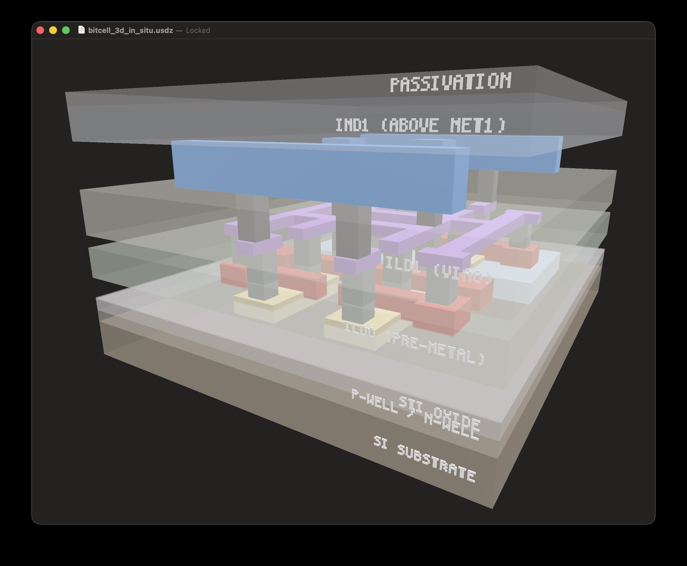

# rekolektion

Open-source SRAM macro generator for the SkyWater SKY130 130nm process.

Takes bitcells (foundry-provided or custom) and generates complete, characterized SRAM macros — parameterized by size, port width, and column mux ratio.



## Why This Exists

The open-source silicon ecosystem has good bitcells (SkyWater's foundry-designed 6T cell at 2.07 μm²) but no easy way to turn them into complete, usable SRAM macros with the specific sizes and port configurations a chip design needs. OpenRAM exists but ships pre-built macros using 8T dual-port cells at ~12 μm², achieving only ~6,000 bits/mm².

rekolektion bridges that gap:
- **Uses SkyWater's production 6T cell** (2.07 μm², foundry-verified) as the default bitcell
- **Generates complete macros** with array tiling, peripheral circuits, power routing, and all output artifacts (GDS, LEF, .lib, Verilog)
- **Parameterized** — specify words × bits, port width, column mux ratio, and get a macro
- **~290,000 bits/mm²** estimated macro density with the foundry cell (vs ~6,000 for pre-built OpenRAM macros)

## Two Bitcell Options

### Foundry cell (default, recommended)
SkyWater's `sram_sp_cell_opt1` — 1.31 × 1.58 μm = 2.07 μm². Uses SRAM-specific transistor models with optimized DRC rules, diagonal li1 cross-coupling, continuous poly gates, and L-shaped diffusion. Foundry-verified. Bundled in the repo.

### Custom cell (educational / fully open)
Our DRC-clean 6T cell built entirely from standard `nfet_01v8`/`pfet_01v8` devices — 2.32 × 3.11 μm = 7.22 μm². Larger than the foundry cell, but:
- **Zero DRC violations** on standard SKY130 rules (no blackbox, no waivers)
- **Fully transparent** — every polygon generated from documented design rules
- **Modifiable** — change transistor sizing, experiment with layout techniques
- **Educational** — the code documents exactly why each dimension is what it is

The custom cell exists to demonstrate what's achievable with standard device rules and to serve as a starting point for anyone who wants to understand or modify an SRAM bitcell layout from scratch.

## What It Does

**Input**: Bitcell choice, target size (words × bits), port width, column mux ratio.

**Output**:
- **GDS** — Layout for fabrication
- **SPICE netlist** — For circuit simulation
- **LEF** — Abstract for place-and-route (planned)
- **Liberty .lib** — Timing model for STA (planned)
- **Verilog** — Behavioral model for simulation (planned)
- **SVG** — 2D layout visualization with layer colors
- **GLB** — 3D visualization with per-layer materials (viewable in macOS Quick Look, any glTF viewer)
- **GLB (in-situ)** — 3D cross-section showing the cell embedded in semi-transparent process strata (substrate, oxides, ILD, passivation) with layer labels
- **STL** — Per-layer 3D meshes for Blender import

## Status

**Phase 2** — Array generation with foundry cell integration.

- Phase 1 complete: custom bitcell DRC-clean, foundry cell integrated
- Phase 2 in progress: array tiling with mirroring, support cells, wiring
- Phases 3-6 planned: peripherals, macro assembly, verification, production macros

## Quick Start

```bash
pip install -e ".[dev]"

# Generate a tiled array using the foundry cell
rekolektion array --cell foundry --rows 8 --cols 32 -o output/array.gds

# Generate custom bitcell GDS + SPICE netlist
rekolektion bitcell -o output/bitcell.gds --spice

# Generate 3D visualizations (STL + colored GLB + in-situ GLB)
python scripts/gds_to_stl.py output/bitcell.gds output/3d/

# Regenerate all outputs after changes
bash scripts/generate_all.sh

# Run DRC (requires Magic + SKY130 PDK)
export PDK_ROOT=$HOME/.volare
bash scripts/run_drc.sh output/bitcell.gds
```

## Architecture

- `src/rekolektion/bitcell/` — Bitcell abstraction, foundry cell loader, custom cell generator
- `src/rekolektion/array/` — Array tiler with mirroring, support cells, routing
- `src/rekolektion/tech/` — SKY130 design rules and layer definitions
- `src/rekolektion/peripherals/` — Row decoder, column mux, sense amp, write driver (planned)
- `src/rekolektion/macro/` — Full macro assembly and output generation (planned)
- `src/rekolektion/verify/` — DRC (Magic), LVS (netgen), SPICE (ngspice) automation
- `scripts/` — Helper scripts for verification, visualization, and output generation

## Prerequisites

- Python >= 3.10
- [gdstk](https://github.com/heitzmann/gdstk) for GDS generation
- [Magic](http://opencircuitdesign.com/magic/) for DRC
- [netgen](http://opencircuitdesign.com/netgen/) for LVS
- [ngspice](http://ngspice.sourceforge.net/) for SPICE simulation
- [SkyWater SKY130 PDK](https://github.com/google/skywater-pdk) (install via [volare](https://github.com/efabless/volare))

## License

Apache 2.0
